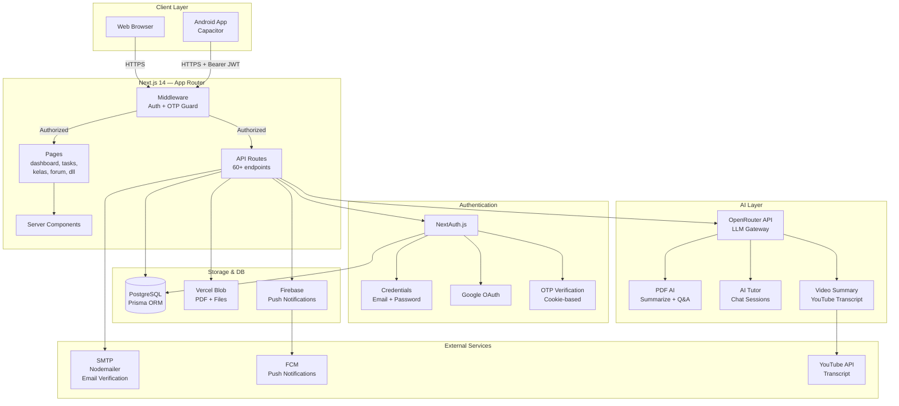

# StudyHub — Architecture Documentation

## System Overview

StudyHub is a full-stack educational platform built with Next.js 14 (App Router), PostgreSQL via Prisma, and Capacitor for mobile.

## Architecture Diagram



## Layer Architecture

```
┌─────────────────────────────────────────┐
│           PRESENTATION LAYER            │
│  Pages (App Router) + Client Components │
├─────────────────────────────────────────┤
│              API LAYER                  │
│  Route Handlers (/api/**)               │
│  Auth middleware + Session validation   │
├─────────────────────────────────────────┤
│            BUSINESS LOGIC               │
│  lib/: auth, mail, notifications,       │
│         ai prompts, schedule logic      │
├─────────────────────────────────────────┤
│             DATA LAYER                  │
│  Prisma ORM → PostgreSQL                │
│  Vercel Blob (files)                    │
│  Firebase (push)                        │
└─────────────────────────────────────────┘
```

## Key Design Decisions

### Authentication Flow
1. User logs in via Credentials or Google OAuth
2. NextAuth issues JWT token
3. Middleware validates JWT on every protected route
4. OTP cookie (`otp_verified_for`) required for full access
5. Mobile uses `Authorization: Bearer <jwt>` header

### Database Pattern
- Single Prisma client singleton (`lib/db.ts`) to avoid connection pool exhaustion
- Transactions used for operations requiring consistency (e.g., create task + award points)
- All queries scoped to `userId` for data isolation

### AI Integration
- OpenRouter as LLM gateway (model-agnostic)
- Streaming responses for AI Tutor
- PDF: extract text → chunk → summarize via prompt templates

### Mobile Support
- Capacitor wraps Next.js web app as Android APK
- Separate mobile auth endpoints (`/api/mobile/login`, `/api/mobile/auth/google`)
- Bearer JWT for stateless mobile authentication

## Feature Map

| Feature | Pages | API Routes | DB Models |
|---------|-------|------------|-----------|
| Auth | /auth/* | /api/auth/* | User, Account, Session, LoginOtp |
| Dashboard | /dashboard | /api/dashboard/* | DashboardDay |
| Tasks | /tasks | /api/tasks/* | Task, ClassTask |
| Notes | /notes | /api/notes/* | Note |
| Kelas | /kelas/* | /api/kelas/* | Group, GroupMember, ClassTask |
| Forum | /forum/* | /api/forum/* | Thread, Reply |
| Flashcards | /flashcards/* | /api/flashcards/* | FlashcardSet, Flashcard |
| AI Tutor | /ai-tutor | /api/ai/* | AISession |
| PDF | /pdf/* | /api/pdf/* | PdfDocument, PdfChallenge |
| Timer | /timer | /api/timer/* | TimerSession |
| Leaderboard | /leaderboard | /api/leaderboard | User.points |
| Analytics | /analytics | /api/analytics | DashboardDay, TimerSession |
| Notifications | — | /api/notifications/* | Notification, FcmToken |

## Tech Stack

| Layer | Technology |
|-------|-----------|
| Framework | Next.js 14 (App Router) |
| Language | TypeScript (strict) |
| Database | PostgreSQL + Prisma ORM |
| Auth | NextAuth.js v4 |
| UI | Bootstrap 5 + React Bootstrap |
| AI | OpenRouter (LLM gateway) |
| File Storage | Vercel Blob |
| Push Notifications | Firebase Cloud Messaging |
| Email | Nodemailer |
| Mobile | Capacitor (Android) |
| Testing | Vitest |
| Deployment | Vercel |
